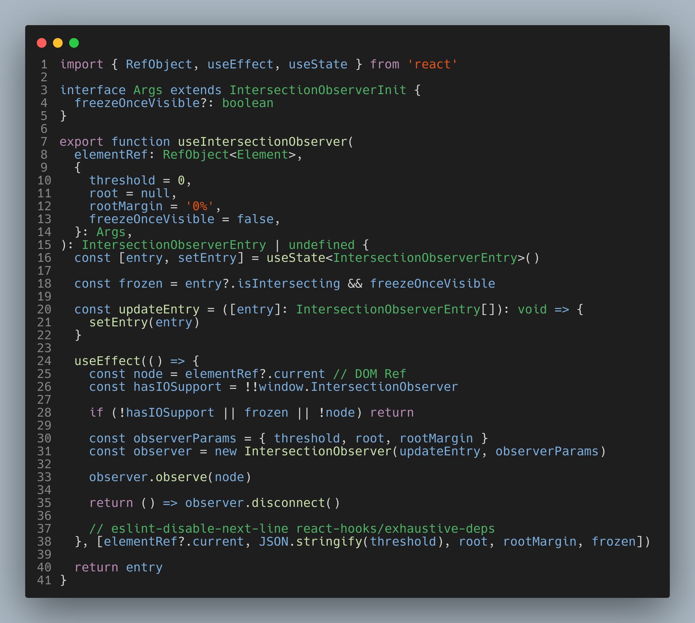

<h1>Colorblind Theme</h1>

Color-blind friendly syntax highlighting for VSCode
 
 

A dark theme created with accessibility in mind. Designed to provide meaningful syntax highlighting for all types of developers, with a special focus on being friendly to color-blind individuals.

The theme is directly based on the work of [Paul Tol](https://personal.sron.nl/~pault/) in data visualization accessibility.

### How It's Made

This theme is generated from the 23-color "discrete rainbow scheme" for colorblind accessibility described [here](https://personal.sron.nl/~pault/). You can view the YAML of the color palette [here](./palette.yaml). Token stylizing and editor appearance directly mirror the VSCode Dark+ theme built into the IDE. The YAML for that color palette is [here](./make/base_palette.yaml), and the template JSON schema is [here](./make/base_template.json). A quick [Python script](./make/main.py) replaces tokens in the schema with a best-match from Paul Tol's design.

### Customizing

Individual colors for the theme can be changed in either [`palette.yaml`](./palette.yaml) for language tokens, or [`base_palette.yaml`](./make/base_palette.yaml) for editor/workbench colors.

The [`main.py`](./make/main.py) can be used to quickly generate a theme with an alternative base to VSCode's Dark+ theme. To do so, install a desired theme in VSCode, and use <kbd>ctrl</kbd>+<kbd>shift</kbd>+<kbd>p</kbd> to open the command palette. Search/select "Developer: Generate Color Scheme From Current Settings", and replace [`base_template.json`](./make/base_template.json) with the resulting file.

You may need to modify the Python code as necessary! Note that the template defines _how_ colors are applied, but you will need to manually pull out preferred color codes.
